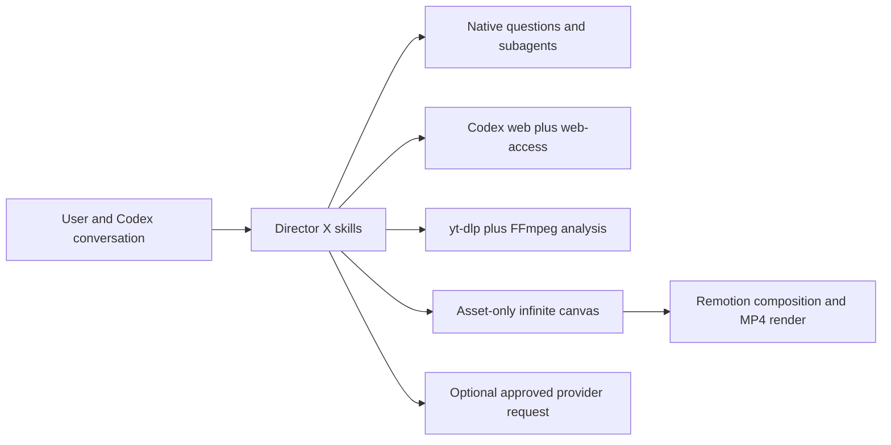

<p align="center">
  
</p>

# Director X — Video creation and understanding for Codex

<p align="center">
  <strong>Infinite media canvas · reference analysis · visual prompts · Remotion composition</strong>
</p>

<p align="center">
  <a href="LICENSE"></a>
  
  
  
</p>

<p align="center">
  <a href="#what-it-does">What it does</a> ·
  <a href="#demo-films">Demos</a> ·
  <a href="#quick-start">Quick start</a> ·
  <a href="#current-architecture">Architecture</a> ·
  <a href="README.zh-CN.md">中文</a> ·
  <a href="skills/directorx/SKILL.md">Core skill</a>
</p>

---

Director X is a lightweight, Codex-native video plugin. It keeps the conversation and decisions in Codex while opening an infinite side canvas for useful production material: images, video, audio, scripts, storyboards, shot lists, visual systems, prompts, and edit notes.

Version 0.2.0 is a clean foundation. It intentionally does **not** add an MCP runtime, a second agent protocol, a durable workflow engine, or a separate desktop application. Codex remains the host, asks native user questions, performs web research, and coordinates native subagents.

## What it does

- Opens an infinite side canvas that previews project images, videos, audio, and production text.
- Uses Codex native `request_user_input` for decisions that materially change the result.
- Uses Codex native subagents for bounded research, reference analysis, visual direction, asset work, and editing tasks.
- Combines Codex web capabilities with the vendored `web-access` skill for browser-rendered or difficult pages.
- Bundles a pinned macOS `yt-dlp` executable and uses packaged FFmpeg/FFprobe dependencies.
- Downloads an approved reference URL, separates audio, extracts frames, estimates scene cuts, creates shot boards, and generates a sampled color system.
- Includes visual prompt-writing guidance distilled from 133 Flova skills.
- Adds generation placeholder nodes when a shot needs an image/video model but no usable API key is available. Each node keeps the production prompt, negative constraints, recommended models, official docs, and target specifications on the canvas.
- Builds simple media sequences with Remotion and renders preview or final MP4 files.
- Stores provider metadata locally and reads API credentials only from a user-selected environment variable.

The plugin does not treat a plan, script, or storyboard as the final result. After a user answers a question, Codex should continue in the same task toward the requested playable media.

## Demo films

These restored 60-second WAIC × MOSS films are previous Director X outputs. Click a poster to open the repository MP4.

<table>
  <tr>
    <td width="50%">
      <a href="site/assets/demos/directorx-waic-moss-promo-v4.mp4">
        
      </a>
      <br />
      <strong>WAIC × MOSS Promo · v4</strong><br />
      <a href="site/assets/demos/directorx-waic-moss-promo-v4.mp4">▶ Play the 60-second film</a>
    </td>
    <td width="50%">
      <a href="site/assets/demos/directorx-waic-moss-promo-v2.mp4">
        
      </a>
      <br />
      <strong>WAIC × MOSS Promo · v2</strong><br />
      <a href="site/assets/demos/directorx-waic-moss-promo-v2.mp4">▶ Play the 60-second film</a>
    </td>
  </tr>
</table>

## Typical workflows

### Make an MV from a song

Director X can guide Codex to:

1. confirm the song source and reuse rights;
2. use web research and `yt-dlp` to acquire an approved source;
3. separate the audio and collect lyrics, background, and artist references;
4. place the audio, images, research, lyrics, script, and storyboard on the canvas;
5. ask for creative decisions through Codex native questions;
6. generate or source shots, compose them with Remotion, and render a playable video.

### Analyze and remake a reference film

For an approved local file or URL, the analyzer produces:

- source metadata and separated WAV audio;
- full extracted frames for videos up to five minutes, or a 2 fps proxy for longer videos;
- FFmpeg-estimated scene boundaries and representative shot frames;
- contact sheets and paginated shot boards;
- a shot-analysis worksheet;
- a sampled color-system JSON file and visual color card.

Codex then examines the evidence for shot purpose, composition, camera and subject motion, typography, lighting, color, transitions, rhythm, and audiovisual synchronization before asking how the user wants to transfer those principles.

## Infinite canvas

The canvas only contains user-facing production material:

- `image`
- `video`
- `audio`
- `text`

Text nodes render a safe Markdown subset including headings, lists, tables, quotes, code, emphasis, and links. Objects may remain isolated or declare dependencies; dependency edges are validated as a DAG and shown directly between cards. The toolbar provides automatic DAG layout, fit-to-canvas, zoom controls, and quick node location. The minimap supports click-and-drag navigation.

It does not show agents, approvals, provider jobs, internal logs, or execution state. Connections describe production-material dependencies, not an internal Agent workflow.


> The restored screenshots record earlier Director X interface exploration. The current 0.2.0 implementation uses a simpler asset-only infinite canvas and does not include the old workflow graph, persistent Run, or custom DX-agent UI shown in these captures.

<table>
  <tr>
    <td width="70%">
      
    </td>
    <td width="30%">
      
    </td>
  </tr>
</table>

## Quick start

### Requirements

- Codex with plugin skills, native user input, native subagents, and the side Browser
- Node.js 22 or later
- macOS for the currently bundled `yt-dlp` executable

### Development checkout

```bash
git clone https://github.com/LaplaceYoung/director-x.git
cd director-x
npm install
npm run ci
```

Add the repository root as a local Codex plugin, then restart Codex so the plugin skills are loaded into a new task.

### Initialize a video project

```bash
node scripts/directorx.mjs doctor
node scripts/directorx.mjs init --project /path/to/video-project
node scripts/directorx.mjs canvas --project /path/to/video-project
```

Open the returned loopback URL in the Codex side Browser.

### Analyze a reference

```bash
node scripts/directorx.mjs analyze \
  --project /path/to/video-project \
  --input /path/to/reference.mp4 \
  --title "Reference film"
```

`--input` may also be an approved URL supported by the bundled downloader.

### Add material to the canvas

```bash
node scripts/directorx.mjs add \
  --project /path/to/video-project \
  --type text \
  --title "Storyboard" \
  --text "# Opening shot"
```

Media files must be inside the video project before they can be registered on the canvas.

Add a dependent node directly, or connect two existing nodes:

```bash
node scripts/directorx.mjs add \
  --project /path/to/video-project \
  --type text \
  --title "Shot 01" \
  --text "## Camera\n\nSlow dolly in." \
  --depends-on BRIEF_NODE_ID

node scripts/directorx.mjs connect \
  --project /path/to/video-project \
  --from SHOT_NODE_ID \
  --to VIDEO_NODE_ID
```

### Continue a generative production without a key

```bash
node scripts/directorx.mjs placeholder \
  --project /path/to/video-project \
  --modality video \
  --title "Shot 03 — rooftop reveal" \
  --aspect-ratio 16:9 \
  --needs camera,identity,audio,multishot \
  --duration 6 \
  --resolution 1080p \
  --fps 24 \
  --prompt "Opening on the product silhouette, the camera slowly cranes upward as the skyline appears."
```

The resulting text node is visibly marked as waiting for generation access. It contains ready-to-use prompt material, shot-ranked mainstream model routes, target parameters, verification status, and official documentation links. The catalog considers Seedance/Seedream, Kling, Veo, Sora, GPT Image, and Imagen. Happy Horse remains an explicitly unverified experimental candidate until authoritative documentation is supplied. Remotion ignores these placeholders; Director X does not silently replace a requested generative shot with a motion-graphics fallback.

### Compose and render

```bash
node scripts/directorx.mjs compose \
  --project /path/to/video-project \
  --title "My film" \
  --width 1920 \
  --height 1080 \
  --fps 30

node scripts/directorx.mjs render \
  --project /path/to/video-project \
  --quality preview
```

## Image and video providers

Director X does not ship or hardcode a generation API key. When generation is needed, Codex should ask for the provider name, model name, official documentation, and the name of a local environment variable containing the key.

```bash
node scripts/directorx.mjs provider configure \
  --project /path/to/video-project \
  --id my-video-model \
  --provider Example \
  --modality video \
  --model example-video-v1 \
  --docs https://provider.example/docs \
  --endpoint https://api.provider.example/v1/videos \
  --auth-env EXAMPLE_API_KEY
```

Provider requests require explicit `--approved`, use HTTPS, remain on the configured origin, and redact credentials from saved request records. Provider response handling is intentionally generic; model-specific payload and result adapters are future work.

## Current architecture



| Area | Current implementation |
| --- | --- |
| Plugin entry | `.codex-plugin/plugin.json` and `skills/directorx/SKILL.md` |
| Canvas | `app/canvas.html` backed by `.directorx/canvas.json` |
| Video understanding | `scripts/analyze-video.mjs` and `scripts/lib/video-analysis.mjs` |
| Generation placeholders | `scripts/lib/generation-placeholders.mjs` |
| Media runtime | packaged FFmpeg/FFprobe dependencies and `runtime/bin/darwin-universal/yt-dlp` |
| Prompt writing | `skills/directorx-prompt-writer/` |
| Web fallback | `skills/directorx-web-access/` |
| Remotion | `remotion/` and `scripts/lib/remotion-project.mjs` |
| Provider boundary | `scripts/lib/provider-profiles.mjs` and `scripts/lib/provider-request.mjs` |

Project-local state is stored under `.directorx/`, including the canvas, analysis artifacts, provider profiles, generated Remotion files, provider request records, and renders.

## Development

```bash
npm run validate:plugin
npm run check
npm test
npm run ci
git diff --check
```

Do not commit credentials or generated project `.directorx/` data. The bundled and npm-provided media tools retain their own third-party licenses; see [runtime/THIRD_PARTY.md](runtime/THIRD_PARTY.md).

## License

Director X is licensed under the [Apache License 2.0](LICENSE).
