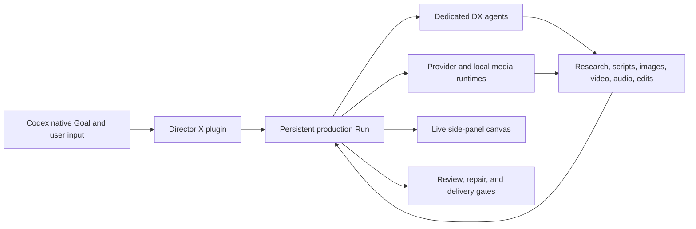

<p align="center">
  
</p>

<p align="center">
  <strong>The open-source video production harness for Codex.</strong>
</p>

<p align="center">
  Turn a creative brief into a persistent, approval-aware production run with native Goals,<br />
  dedicated filmmaking agents, and a live side-panel canvas.
</p>

<p align="center">
  <a href="LICENSE"></a>
  
  
  
</p>

<p align="center">
  <a href="https://laplaceyoung.github.io/director-x/">Website</a> ·
  <a href="#quick-start">Quick Start</a> ·
  <a href="#why-director-x">Why Director X</a> ·
  <a href="README.zh-CN.md">中文</a> ·
  <a href="skills/directorx/SKILL.md">Production Skill</a>
</p>

---

Director X is a Codex-native orchestration layer for AI video production. It does not replace image, video, speech, music, or editing models. It coordinates them through one durable production run with explicit approvals, media evidence, cost controls, continuity checks, editing, and final review.

The current open-source release is the **Director X Codex plugin**. It is the first public part of a larger Video Harness product.

> [!IMPORTANT]
> **Coming next:** we are actively building the complete **Director X Video Harness** by adapting the [Pi Agent Harness](https://github.com/earendil-works/pi) runtime for video-native production, together with an **Electron desktop application** for local media, canvas workflows, providers, editing, review, and delivery.


## Why Director X

### Native Codex Goals

Every production is bound to a real Codex Goal. Planning documents are not treated as completion: the Goal remains active until the requested media has been produced, reviewed, and approved for delivery.

Director X uses Codex-native user input for decisions that materially change the result, including budget, providers, model routes, reference downloads, edit changes, and final delivery.


### Dedicated DX Agents

Director X registers specialist production roles instead of treating every parallel task as an anonymous worker. Roles include:

- `DX-Director` for creative direction and production decisions
- `DX-Reference-Analyst` for reference-video and source analysis
- `DX-Asset-Manager` for acquisition, provenance, rights, and quality checks
- `DX-Shot-Planner` for shot design, coverage, and continuity
- `DX-Model-Router` and `DX-Cost-Controller` for provider and budget routing
- `DX-Editor` and `DX-Quality-Reviewer` for the cut, render, and final audit
- `DX-Approval-Producer` for user-facing approval boundaries

Independent roles can work concurrently while their ownership, dependencies, outputs, and handoffs remain visible in the persistent Run.


### Live Production Canvas

The side-panel canvas is a real-time projection of the durable Director X Run. It updates as research, scripts, images, video, audio, edits, and review evidence are created.

The canvas is designed around production assets rather than a decorative fixed workflow:

- preview generated and acquired image, video, and audio files
- trace relationships between references, scripts, keyframes, clips, and final renders
- surface approvals, blockers, provider jobs, and recovery actions
- inspect timelines, captions, waveforms, comparisons, and frame-level review evidence
- resume from persisted state after the browser surface or MCP runtime restarts

## How It Works

```text
Bind a native Codex Goal
        ↓
Resolve the minimum creative and budget decisions
        ↓
Dispatch dedicated DX production agents
        ↓
Research, script, storyboard, generate, and edit
        ↓
Project media and relationships onto the live canvas
        ↓
Review, repair, render, and approve delivery
```

Director X keeps production state under `.directorx/plugin-runs/`. The canvas reads that state; it does not maintain a separate version of the truth.

## Quick Start

### Requirements

- A Codex build with plugins, native Goals, native user input, subagents, and the side Browser
- Node.js 22 or later
- FFmpeg and FFprobe for local media inspection and rendering
- Provider credentials only when using paid external generation services

### Install the plugin

```bash
codex plugin marketplace add https://github.com/LaplaceYoung/director-x.git --ref main
codex plugin add directorx@openmoss-local
codex plugin list
```

Fully quit and reopen Codex after installation. Plugin tools and custom `dx_*` agent roles are loaded when the Codex task host starts and cannot be reliably hot-loaded into an existing task.

### Start a production

Open a new Codex task and enter:

```text
@directorx Create a 30-second product film.
Use a native Goal, ask only for decisions that change the result,
show acquired and generated media on the live canvas,
and do not finish until a reviewed video is ready for delivery.
```

For the Chinese project overview and installation guide, see [README.zh-CN.md](README.zh-CN.md).

## Production Capabilities

- Fast-start Intake that moves into visible creative work before deferred governance
- Official-first web research and locally acquired, provenance-tracked assets
- Full-frame reference-video analysis with originality and rights boundaries
- Script, shot list, scene coverage, transition, and visual-prompt contracts
- Provider-neutral image, video, speech, and music routing
- Official-pricing evidence and bounded project, stage, shot, and attempt budgets
- First/last-frame continuity, multi-segment stitching, and long-form handoffs
- Remotion, HyperFrames, FFmpeg, MOSS-TTS, and Whisper media paths
- Director X Cut for evidence-linked, approval-gated timeline changes
- Exhaustive decoded-frame audit and structured final quality review
- Durable checkpoints, minimal recovery actions, and single-Run resume behavior

## Architecture



The plugin contains three main surfaces:

- **Skills** define professional video-production behavior and artifact contracts.
- **MCP runtime** owns the persistent Run, approvals, tools, provider execution, recovery, and canvas projection.
- **Browser apps** provide the live production canvas and Director X Cut editing surface.

Provider credentials are session-only. Raw keys must not be written to Git, durable Run JSON, logs, or production artifacts.

## What Is Coming Next

The Codex plugin is the open-source first release and proving ground. Work is already underway on the larger Director X product line:

| Product | Status | Scope |
| --- | --- | --- |
| Director X Codex plugin | **Available now · early access** | Native Goals, DX agents, live canvas, production tools, editing, and review inside Codex |
| Director X Video Harness | **In active development** | A complete video-native harness adapting the [Pi Agent Harness](https://github.com/earendil-works/pi) runtime for persistent production execution, provider routing, media memory, editing, review, and delivery |
| Director X Desktop | **In active development** | An Electron application that brings local projects, media, the live canvas, provider configuration, editing, review, rendering, and delivery into one production workspace |

The future Video Harness and Electron application are not included in the current plugin release. This repository is the open-source Codex integration and the public proving ground for Director X production contracts.

## Development

```bash
git clone https://github.com/LaplaceYoung/director-x.git
cd director-x
node --version
pnpm test
pnpm check
```

The plugin runtime intentionally has no production npm dependencies. Tests exercise the MCP protocol, persistent Run, media canvas, provider routing, editing, recovery, and review contracts.

## Contributing

Issues and focused pull requests are welcome. Please keep changes small, include regression coverage for production-tool behavior, and avoid committing credentials, generated media, or local `.directorx/` Run data.

Before opening a pull request:

```bash
pnpm test
pnpm check
git diff --check
```

## Privacy and Terms

- [Privacy Policy](PRIVACY.md)
- [Terms of Service](TERMS.md)
- [Third-Party Notices](THIRD_PARTY_NOTICES.md)

## License

Director X is licensed under the [GNU Affero General Public License v3.0 or later](LICENSE).

---

<p align="center">
  Built by <strong>openmoss</strong> for video production that stays visible, controllable, and accountable.
</p>
