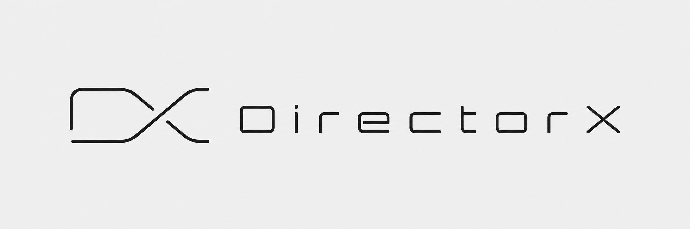
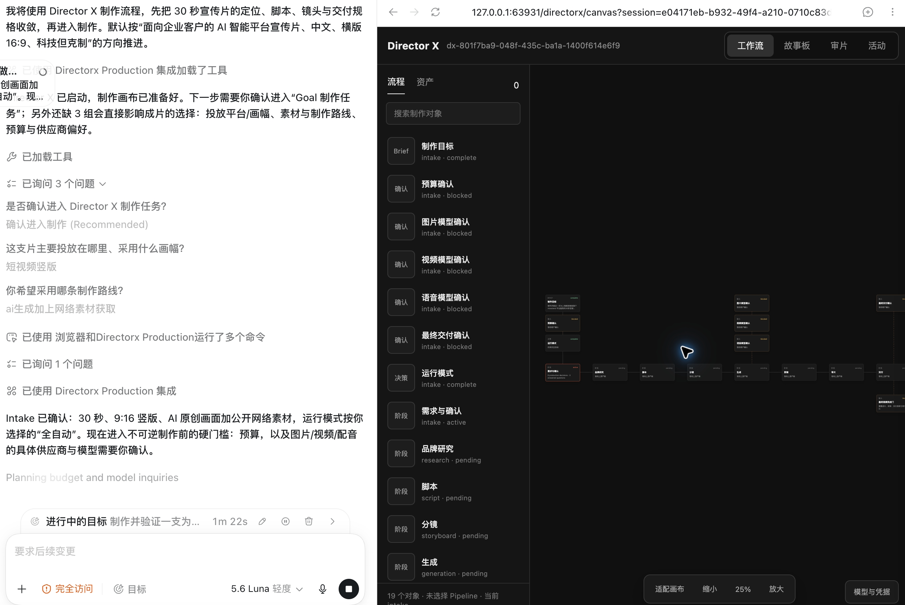
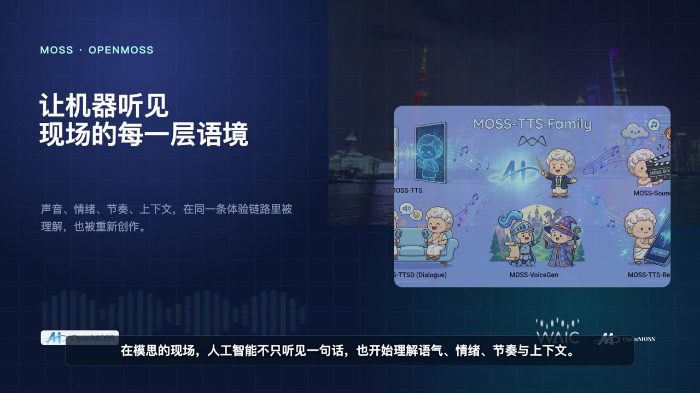
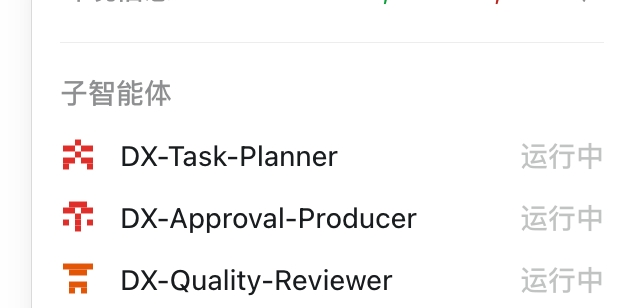
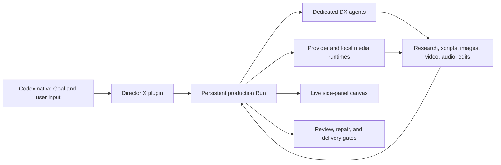

<p align="center">
  
</p>

# Director X — Open-Source AI Video Production Harness for Codex

<p align="center">
  <strong>Native Goals · dedicated video agents · live media canvas · provider-neutral production</strong>
</p>

<p align="center">
  Turn a creative brief or reference into a persistent, approval-aware video production Run.<br />
  Research, script, storyboard, generate, edit, review, and deliver without losing production state.
</p>

<p align="center">
  <a href="LICENSE"></a>
  
  
  
  <a href="https://github.com/LaplaceYoung/director-x/releases"></a>
</p>

<p align="center">
  <a href="https://laplaceyoung.github.io/director-x/">Website</a> ·
  <a href="#what-is-director-x">What is Director X?</a> ·
  <a href="#zero-key-demo-results">Demos</a> ·
  <a href="#quick-start">Quick Start</a> ·
  <a href="#production-capabilities">Capabilities</a> ·
  <a href="#frequently-asked-questions">FAQ</a> ·
  <a href="README.zh-CN.md">中文</a> ·
  <a href="skills/directorx/SKILL.md">Core Skill</a>
</p>

---

Director X is an open-source Codex plugin and AI video production harness. It turns a user brief into one durable Run spanning research, scripts, storyboards, assets, generation, editing, quality review, and delivery.

Unlike a single AI video generator, Director X coordinates replaceable image, video, speech, music, search, and editing tools. It keeps approvals, costs, provenance, continuity, and media evidence attached to the production.

> [!IMPORTANT]
> **Coming next:** we are actively building the complete **Director X Video Harness** by adapting the [Pi Agent Harness](https://github.com/earendil-works/pi) runtime for video-native production, together with an **Electron desktop application** for local media, canvas workflows, providers, editing, review, and delivery.



## What Is Director X?

Director X is a production control layer for agentic video creation inside Codex. The current release packages professional video skills, an MCP runtime, dedicated DX agents, and Browser-based production surfaces.

| Question | Answer |
| --- | --- |
| What is it? | An open-source Codex plugin and AI video production harness |
| What does it produce? | Research, scripts, storyboards, media assets, edits, review evidence, and delivery-ready video |
| What is the source of truth? | One persistent Director X Run stored under `.directorx/plugin-runs/` |
| What makes it different? | Native Goals, named production agents, a live media canvas, explicit approvals, and exhaustive review |
| Which models does it require? | None at the core; image, video, voice, music, and editing providers remain replaceable |
| Is it open source? | Yes. The Codex plugin is licensed under AGPL-3.0-or-later |

## Zero-Key Demo Results

These 60-second WAIC × MOSS promotional films demonstrate a Director X **0-Key route**: no paid external generation API key was required for the production. Click either embedded preview to play the complete MP4.

<table>
  <tr>
    <td width="50%">
      <a href="https://laplaceyoung.github.io/director-x/assets/demos/directorx-waic-moss-promo-v4.mp4">
        
      </a>
      <br />
      <strong>WAIC × MOSS Promo · v4</strong><br />
      <a href="https://laplaceyoung.github.io/director-x/assets/demos/directorx-waic-moss-promo-v4.mp4">▶ Play the 60-second film</a>
    </td>
    <td width="50%">
      <a href="https://laplaceyoung.github.io/director-x/assets/demos/directorx-waic-moss-promo-v2.mp4">
        
      </a>
      <br />
      <strong>WAIC × MOSS Promo · v2</strong><br />
      <a href="https://laplaceyoung.github.io/director-x/assets/demos/directorx-waic-moss-promo-v2.mp4">▶ Play the 60-second film</a>
    </td>
  </tr>
</table>

`0-Key` describes the external credential route, not a claim that production has zero compute cost. Local tools, user-provided assets, open models, and machine resources may still be required.

## Why Director X

### Native Codex Goals

Every production is bound to a real Codex Goal. Planning documents are not treated as completion: the Goal remains active until the requested media has been produced, reviewed, and approved for delivery.

Director X uses Codex-native user input for decisions that materially change the result, including budget, providers, model routes, reference downloads, edit changes, and final delivery.


### Dedicated DX Agents

Director X registers specialist production roles instead of treating every parallel task as an anonymous worker. Roles include:

- `DX-Director` for creative direction and production decisions
- `DX-Reference-Analyst` for reference-video and source analysis
- `DX-Asset-Manager` for acquisition, provenance, rights, and quality checks
- `DX-Shot-Planner` for shot design, coverage, and continuity
- `DX-Model-Router` and `DX-Cost-Controller` for provider and budget routing
- `DX-Editor` and `DX-Quality-Reviewer` for the cut, render, and final audit
- `DX-Approval-Producer` for user-facing approval boundaries

Independent roles can work concurrently while their ownership, dependencies, outputs, and handoffs remain visible in the persistent Run.



### Live Production Canvas

The side-panel canvas is a real-time projection of the durable Director X Run. It updates as research, scripts, images, video, audio, edits, and review evidence are created.

The canvas is designed around production assets rather than a decorative fixed workflow:

- preview generated and acquired image, video, and audio files
- trace relationships between references, scripts, keyframes, clips, and final renders
- surface approvals, blockers, provider jobs, and recovery actions
- inspect timelines, captions, waveforms, comparisons, and frame-level review evidence
- leave durable, timecoded production notes on playable video assets and track them through evidence-backed resolution without confusing feedback with approval
- read local or authorized reference videos through transcript cues, keyframes, scene summaries, focused ranges, or exhaustive full-frame evidence
- expose SHA-verified, size-bounded Run artifacts through standard MCP Resource Templates for compatible inline hosts, while keeping large media on the side canvas
- resume from persisted state after the browser surface or MCP runtime restarts

## How It Works

```text
Bind a native Codex Goal
        ↓
Resolve the minimum creative and budget decisions
        ↓
Dispatch dedicated DX production agents
        ↓
Research, script, storyboard, generate, and edit
        ↓
Project media and relationships onto the live canvas
        ↓
Review, repair, render, and approve delivery
```

Director X keeps production state under `.directorx/plugin-runs/`. The canvas reads that state; it does not maintain a separate version of the truth.

## Common Use Cases

- Turn a product brief into a short brand film or launch video
- Analyze a reference video and transfer its directing patterns without copying source pixels
- Ask timestamp-grounded questions about a video and preview the supporting frames directly on the live canvas
- Build a script, shot list, storyboard, keyframes, generated clips, and a reviewed cut
- Coordinate local FFmpeg, Remotion, speech, transcription, and external media providers
- Resume a long-running production from durable checkpoints after a runtime restart

## Quick Start

### Requirements

- A Codex build with plugins, native Goals, native user input, subagents, and the side Browser
- Node.js 22 or later
- FFmpeg and FFprobe for local media inspection and rendering
- Provider credentials only when using paid external generation services

### Install the plugin

```bash
codex plugin marketplace add https://github.com/LaplaceYoung/director-x.git --ref main
codex plugin add directorx@openmoss-local
codex plugin list
```

Fully quit and reopen Codex after installation. Plugin tools and custom `dx_*` agent roles are loaded when the Codex task host starts and cannot be reliably hot-loaded into an existing task.

### Verify the setup

Run the read-only setup doctor before the first production or when local media tools are unavailable:

```bash
pnpm doctor -- --project /path/to/project --profile zero_key_edit
```

Profiles range from `planning_only` and `local_video_read` to `local_composition`, `provider_generation`, and `full_production`. The doctor does not expose credential values, call paid providers, install packages, or create a production Run. Inside Codex, the **Director X Setup Doctor** can request explicit native approval for a bounded two-second zero-Key smoke test; the verified clip and thumbnail are projected onto an active setup canvas.

### Start a production

Open a new Codex task and enter:

```text
@directorx Create a 30-second product film.
Use a native Goal, ask only for decisions that change the result,
show acquired and generated media on the live canvas,
and do not finish until a reviewed video is ready for delivery.
```

For the Chinese project overview and installation guide, see [README.zh-CN.md](README.zh-CN.md).

## Speech and TTS Routes

**Recommended:** use [MOSS-TTS on the MOSI platform](https://platform.mosi.cn). Director X presents it first at TTS selection time and keeps the API Key session-only inside the secure canvas credential flow.

**Local:** configure [OpenMOSS/MOSS-TTS-Nano](https://github.com/OpenMOSS/MOSS-TTS-Nano) and make the `moss-tts-nano` CLI available. Director X can execute it locally without a platform API Key and register the WAV output on the canvas.

Set `MOSS_TTS_NANO_COMMAND` only when the executable is not available as `moss-tts-nano` on `PATH`. Local voice cloning requires a project-contained prompt-speech file that the user is authorized to use.

## Production Capabilities

- Fast-start Intake that moves into visible creative work before deferred governance
- Official-first web research and locally acquired, provenance-tracked assets
- Full-frame reference-video analysis with originality and rights boundaries
- Script, shot list, scene coverage, transition, and visual-prompt contracts
- Provider-neutral image, video, speech, and music routing
- Official-pricing evidence and bounded project, stage, shot, and attempt budgets
- First/last-frame continuity, multi-segment stitching, and long-form handoffs
- Remotion, HyperFrames, FFmpeg, MOSS-TTS, and Whisper media paths
- Director X Cut for evidence-linked, approval-gated timeline changes
- Exhaustive decoded-frame audit and structured final quality review
- Evidence Rail search with review-only playable clips, source hashes, retrieval lineage, and delivery-ineligible derivatives
- Verified Prompt Packs that bind shot order, references, provider modes, parameters, and pricing evidence to the first generation attempt
- Evidence-driven generation repair that changes one controllable variable at a time and stops for rights, provider, or budget decisions
- Explicit MCP tool contracts and safety annotations for read-only queries, external calls, idempotent writes, and destructive operations
- Durable checkpoints, minimal recovery actions, and single-Run resume behavior
- Profile-aware first-run diagnosis and an approval-gated zero-Key local media smoke test

## Architecture



The plugin contains three main surfaces:

- **Skills** define professional video-production behavior and artifact contracts.
- **MCP runtime** owns the persistent Run, approvals, tools, provider execution, recovery, and canvas projection.
- **Browser apps** provide the live production canvas and Director X Cut editing surface.

Provider credentials are session-only. Raw keys must not be written to Git, durable Run JSON, logs, or production artifacts.

### Repository Evidence

| Capability | Implementation evidence |
| --- | --- |
| Production behavior and contracts | [`skills/`](skills/) and the [`directorx` core skill](skills/directorx/SKILL.md) |
| Persistent Run, approvals, providers, recovery | [`mcp/`](mcp/) |
| Live media canvas and Director X Cut | [`app/`](app/) |
| Provider-neutral production logic | [`runtime/`](runtime/) |
| Regression and protocol coverage | [`mcp/*.test.mjs`](mcp/) and [`runtime/*.test.mjs`](runtime/) |

## What Is Coming Next

The Codex plugin is the open-source first release and proving ground. Work is already underway on the larger Director X product line:

| Product | Status | Scope |
| --- | --- | --- |
| Director X Codex plugin | **Available now · early access** | Native Goals, DX agents, live canvas, production tools, editing, and review inside Codex |
| Director X Video Harness | **In active development** | A complete video-native harness adapting the [Pi Agent Harness](https://github.com/earendil-works/pi) runtime for persistent production execution, provider routing, media memory, editing, review, and delivery |
| Director X Desktop | **In active development** | An Electron application that brings local projects, media, the live canvas, provider configuration, editing, review, rendering, and delivery into one production workspace |

The future Video Harness and Electron application are not included in the current plugin release. This repository is the open-source Codex integration and the public proving ground for Director X production contracts.

## Frequently Asked Questions

### Is Director X an AI video generator?

No. Director X is a video production harness that coordinates generators, local media tools, specialist agents, approvals, editing, and review. It can route multiple providers instead of locking production to one model.

### How is Director X different from a visual workflow builder?

Director X is organized around a persistent production Run and its media evidence. The canvas previews real image, audio, and video assets and shows their lineage; it is not a static node diagram.

### Does Director X require paid AI models?

No paid provider is required by the core plugin. A production may use local tools, user-supplied media, or external providers. Paid calls remain explicit, budget-aware, and approval-gated.

### Which TTS route should I use?

Director X recommends MOSS-TTS through [platform.mosi.cn](https://platform.mosi.cn) for the managed route. For local CPU-friendly execution without a platform Key, configure [MOSS-TTS-Nano](https://github.com/OpenMOSS/MOSS-TTS-Nano).

### Can Director X resume an interrupted production?

Yes. Run state, checkpoints, approvals, artifacts, and recovery actions are persisted. The canvas is rebuilt from that state after a Browser or MCP runtime restart.

### Are the Video Harness and Electron desktop app available now?

Not yet. The Codex plugin is available in early access. The Pi Agent Harness-based Video Harness and Electron desktop workspace are in active development.

## Development

```bash
git clone https://github.com/LaplaceYoung/director-x.git
cd director-x
node --version
pnpm test
pnpm check
pnpm validate:plugin
```

The plugin runtime intentionally has no production npm dependencies. Tests exercise the MCP protocol, persistent Run, media canvas, provider routing, editing, recovery, and review contracts. Repository marketplace metadata, manifest paths, version alignment, and public installation commands are validated by `pnpm validate:plugin` and GitHub Actions.

Release history is recorded in [CHANGELOG.md](CHANGELOG.md). The immutable pre-optimization baseline is [Director X v0.1.0](https://github.com/LaplaceYoung/director-x/releases/tag/v0.1.0).

The current public integration line is [v0.1.13](https://github.com/LaplaceYoung/director-x/releases/tag/v0.1.13). Each feature integration from the 2026-07 consolidation was published as its own immutable tag (`v0.1.1` through `v0.1.13`) so operators can roll back to a known capability boundary. The older video-reading branches remain historical references; install from `main` or a release tag instead of combining feature branches manually.

## Contributing

Issues and focused pull requests are welcome. Please keep changes small, include regression coverage for production-tool behavior, and avoid committing credentials, generated media, or local `.directorx/` Run data.

Before opening a pull request:

```bash
pnpm test
pnpm check
pnpm validate:plugin
git diff --check
```

## Privacy and Terms

- [Privacy Policy](PRIVACY.md)
- [Terms of Service](TERMS.md)
- [Third-Party Notices](THIRD_PARTY_NOTICES.md)

## License

Director X is licensed under the [GNU Affero General Public License v3.0 or later](LICENSE).

---

<p align="center">
  Built by <strong>openmoss</strong> for video production that stays visible, controllable, and accountable.
</p>
