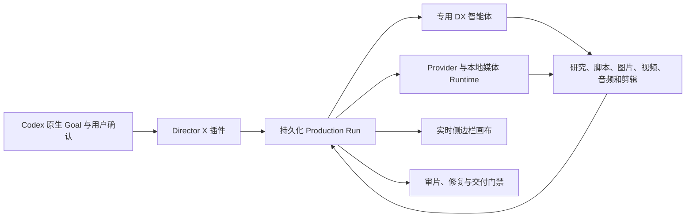

<p align="center">
  
</p>

# Director X — 面向 Codex 的开源 AI 视频制片 Harness

<p align="center">
  <strong>原生 Goal · 专用视频智能体 · 实时媒体画布 · Provider 中立制片</strong>
</p>

<p align="center">
  将创意需求或参考片转化为可持续运行、可审批的视频制片 Run。<br />
  从研究、脚本和分镜推进到生成、剪辑、审片与成片交付。
</p>

<p align="center">
  <a href="LICENSE"></a>
  
  
  
  <a href="https://github.com/LaplaceYoung/director-x/releases"></a>
</p>

<p align="center">
  <a href="https://laplaceyoung.github.io/director-x/">产品网站</a> ·
  <a href="#director-x-是什么">Director X 是什么</a> ·
  <a href="#0-key-demo-成果">Demo 成果</a> ·
  <a href="#快速开始">快速开始</a> ·
  <a href="#主要能力">主要能力</a> ·
  <a href="#常见问题">常见问题</a> ·
  <a href="README.md">English</a> ·
  <a href="skills/directorx/SKILL.md">核心 Skill</a>
</p>

---

Director X 是开源的 Codex 插件和 AI 视频制片 Harness。它将用户需求转化为一个持久化 Run，覆盖研究、脚本、分镜、素材、生成、剪辑、质量审查和交付。

它不是单一的 AI 视频生成器，而是协调可替换的图片、视频、语音、音乐、搜索和剪辑工具，并把审批、成本、来源、连续性与媒体证据持续绑定在同一次制片任务中。

> [!IMPORTANT]
> **接下来：**我们正在基于 [Pi Agent Harness](https://github.com/earendil-works/pi) Runtime 改造完整的 **Director X Video Harness**，并同步开发 **Electron 桌面端应用**，用于统一管理本地媒体、画布工作流、Provider、剪辑、审片和交付。


## Director X 是什么？

Director X 是运行在 Codex 内的智能体视频制片控制层。当前版本由专业视频 Skills、MCP Runtime、专用 DX 智能体和基于 Browser 的制片界面组成。

| 问题 | 回答 |
| --- | --- |
| 它是什么？ | 开源 Codex 插件和 AI 视频制片 Harness |
| 它能产出什么？ | 研究、脚本、分镜、媒体素材、剪辑版本、审片证据和可交付视频 |
| 唯一事实源是什么？ | 保存在 `.directorx/plugin-runs/` 下的持久化 Director X Run |
| 它有什么不同？ | 原生 Goal、实名制片智能体、实时媒体画布、明确审批和完整审片 |
| 必须使用哪些模型？ | 核心不绑定模型；图片、视频、语音、音乐和剪辑 Provider 都可替换 |
| 是否开源？ | 是。Codex 插件使用 AGPL-3.0-or-later 许可证 |

## 0-Key Demo 成果

下面两支 60 秒 WAIC × MOSS 宣传片展示了 Director X 的 **0-Key 制片路线**：制作过程不需要付费外部生成 API Key。点击任一内嵌封面即可播放完整 MP4。

<table>
  <tr>
    <td width="50%">
      <a href="https://laplaceyoung.github.io/director-x/assets/demos/directorx-waic-moss-promo-v4.mp4">
        
      </a>
      <br />
      <strong>WAIC × MOSS 宣传片 · v4</strong><br />
      <a href="https://laplaceyoung.github.io/director-x/assets/demos/directorx-waic-moss-promo-v4.mp4">▶ 播放 60 秒成片</a>
    </td>
    <td width="50%">
      <a href="https://laplaceyoung.github.io/director-x/assets/demos/directorx-waic-moss-promo-v2.mp4">
        
      </a>
      <br />
      <strong>WAIC × MOSS 宣传片 · v2</strong><br />
      <a href="https://laplaceyoung.github.io/director-x/assets/demos/directorx-waic-moss-promo-v2.mp4">▶ 播放 60 秒成片</a>
    </td>
  </tr>
</table>

`0-Key` 指不依赖付费外部生成服务凭证，不代表制片没有计算成本。本地工具、用户素材、开放模型和机器资源仍可能是生产条件。

## 为什么使用 Director X

### Codex 原生 Goal

每支视频都绑定到真实的 Codex Goal。完成策划文档并不代表任务结束；只有目标媒体已经生成、通过审查并得到交付确认后，Goal 才能完成。

预算、模型路线、参考素材下载、重要剪辑修改和最终交付等决定，都通过 Codex 原生用户确认完成，不依赖容易混淆的普通聊天文字。


### 专用 DX 子智能体

Director X 注册了明确的视频制片角色，而不是把所有并行任务都交给匿名通用 Agent：

- `DX-Director`：创意方向和阶段决策
- `DX-Reference-Analyst`：参考片与来源分析
- `DX-Asset-Manager`：素材获取、来源、版权和质量检查
- `DX-Shot-Planner`：镜头、场景覆盖与连续性设计
- `DX-Director`：直接负责供应商/模型路由、能力核验、回退选择与预算控制
- `DX-Editor`、`DX-Quality-Reviewer`：剪辑、渲染和最终审片
- `DX-Approval-Producer`：整理需要用户确认的生产门禁

没有依赖关系的角色可以并行工作，同时保留清晰的任务归属、输入输出、依赖关系和交接记录。


### 实时侧边栏画布

侧边栏画布是持久化 Director X Run 的实时投影。研究资料、脚本、图片、视频、音频、剪辑版本和审片证据产生后，画布会同步更新。

画布围绕真实制片资产设计，而不是展示一张固定流程图：

- 预览生成或获取到的图片、视频和音频文件
- 绘制参考资料、脚本、关键帧、镜头和成片之间的关系
- 展示审批、阻塞、Provider 任务和恢复动作
- 查看时间线、字幕、波形、A/B 对比和逐帧审片证据
- 对可播放视频留下持久化时间码反馈，并跟踪到带修复证据的解决状态；制作意见不会被误当作审批
- 通过字幕线索、关键帧、场景摘要、局部时间段或完整逐帧证据“阅读”本地与已授权参考视频
- 通过标准 MCP Resource Template 向兼容宿主提供经过 SHA 校验、大小受限的 Run 资产，较大媒体仍在侧边栏画布中预览
- 在浏览器页面或 MCP Runtime 重启后，从持久化状态继续

## 工作方式

```text
绑定 Codex 原生 Goal
        ↓
确认最少必要的创意与预算决定
        ↓
派发专用 DX 制片智能体
        ↓
研究、脚本、分镜、生成和剪辑
        ↓
在侧边栏画布展示媒体与关系
        ↓
审片、修复、渲染并确认交付
```

生产状态保存在 `.directorx/plugin-runs/`。画布只读取和投影这份状态，不维护第二套可能过期的事实源。

## 常见使用场景

- 将产品需求制作成品牌短片、发布视频或产品宣传片
- 分析参考视频并迁移导演方法，同时避免复制参考片源像素
- 针对视频提出带时间戳的问题，并在实时画布直接预览支撑结论的画面证据
- 完成脚本、镜头表、分镜、关键帧、生成镜头和最终审片
- 编排本地 FFmpeg、Remotion、语音、转录和外部媒体 Provider
- Runtime 重启后从持久化检查点恢复长时间制片任务

## 快速开始

### 环境要求

- 支持插件、原生 Goal、原生用户确认、子智能体和侧边 Browser 的 Codex 版本
- Node.js 22 或更高版本
- 用于本地媒体检查和渲染的 FFmpeg 与 FFprobe
- 只有在调用付费外部生成服务时才需要 Provider Key

### 安装插件

```bash
codex plugin marketplace add https://github.com/LaplaceYoung/director-x.git --ref main
codex plugin add directorx@mosi
codex plugin list
```

安装后需要完整退出并重新打开 Codex。插件工具和自定义 `dx_*` Agent 角色在任务宿主启动时加载，已打开的旧任务无法可靠地热加载这些能力。

### 验证安装状态

首次制作前，或本地媒体能力异常时，运行只读安装诊断：

```bash
pnpm doctor -- --project /path/to/project --profile zero_key_edit
```

诊断档位覆盖 `planning_only`、`local_video_read`、`zero_key_edit`、`local_composition`、`provider_generation` 和 `full_production`。诊断不会返回凭证值、调用付费 Provider、安装软件包或创建 Production Run。在 Codex 内，**Director X Setup Doctor** 只有经过原生用户确认，才会运行边界明确的 2 秒零 Key 音视频测试；通过验证的视频和缩略图会投影到当前安装画布。

### 开始制作

在新的 Codex 任务中输入：

```text
@directorx 制作一支 30 秒产品宣传片。
使用原生 Goal，只询问会改变成片结果的问题，
在侧边栏画布展示获取和生成的媒体，
得到通过审查的成片之前不要结束任务。
```

如果插件没有打开侧边栏画布、没有创建 Goal，或者只生成了策划文档就结束，请确认插件已启用并完整重启 Codex 后，在新任务中重新调用。

## 语音与 TTS 路线

**推荐路线：**使用 [MOSI 平台上的 MOSS-TTS](https://platform.mosi.cn)。Director X 会在 TTS 选择时优先推荐，并通过画布安全凭证流程把 API Key 仅注入当前会话。

**本地路线：**配置 [OpenMOSS/MOSS-TTS-Nano](https://github.com/OpenMOSS/MOSS-TTS-Nano)，并确保本机可以调用 `moss-tts-nano` CLI。Director X 可以在不使用平台 API Key 的情况下生成本地 WAV 并注册到画布。

仅当 CLI 不在 `PATH` 中时设置 `MOSS_TTS_NANO_COMMAND`。本地声音克隆需要项目内的参考语音文件，并且用户必须拥有相应使用授权。

## 主要能力

- 快速 Intake：先进入可见创作，详细治理工件延后补齐
- 官方来源优先的联网研究和带来源证明的本地素材
- 参考视频全帧分析、版权边界与原创迁移规则
- 脚本、镜头表、场景覆盖、转场和视觉提示词合同
- Provider 中立的图片、视频、语音和音乐路由
- 基于官方定价证据的项目、阶段、镜头和尝试预算
- 首尾帧连续性、多片段拼接和长视频交接
- Remotion、HyperFrames、FFmpeg、MOSS-TTS 和 Whisper 路线
- Director X Cut 证据驱动、审批后生效的时间线修改
- 完整解码帧审计和结构化最终质量审查
- Evidence Rail 证据检索、可播放审看片段、源文件 hash、检索 lineage 和不可直接交付的派生素材边界
- 已验证的 Prompt Pack：把镜头顺序、参考素材、Provider 模式、参数和定价证据绑定到第一次生成尝试
- 证据驱动的生成修复：一次只修改一个可控变量，并在版权、Provider 或预算问题上停止等待决定
- 明确的 MCP 工具合同与安全标注，区分只读查询、外部调用、幂等写入和破坏性操作
- 持久化检查点、最小恢复动作和单 Run 恢复机制
- 按工作模式诊断首次安装，并通过原生确认运行零 Key 本地媒体测试

## 架构



插件包含三个主要部分：

- **Skills**：定义专业视频制作行为和工件合同。
- **MCP Runtime**：管理持久化 Run、审批、工具调用、Provider 执行、恢复和画布投影。
- **Browser Apps**：提供实时制作画布和 Director X Cut 剪辑界面。

Provider Key 只注入当前会话，不应写入 Git、持久化 Run JSON、日志或制片工件。

### 仓库事实依据

| 能力 | 实现依据 |
| --- | --- |
| 制片行为与工件合同 | [`skills/`](skills/) 与 [`directorx` 核心 Skill](skills/directorx/SKILL.md) |
| 持久化 Run、审批、Provider 与恢复 | [`mcp/`](mcp/) |
| 实时媒体画布与 Director X Cut | [`app/`](app/) |
| Provider 中立制片逻辑 | [`runtime/`](runtime/) |
| 协议与行为回归覆盖 | [`mcp/*.test.mjs`](mcp/) 与 [`runtime/*.test.mjs`](runtime/) |

## 接下来正在开发

Codex 插件是首个开源版本，也是完整 Director X 产品线的公开验证入口。目前以下产品已经进入开发：

| 产品 | 状态 | 范围 |
| --- | --- | --- |
| Director X Codex 插件 | **现已开放 · 早期版本** | Codex 内的原生 Goal、DX 智能体、实时画布、制片工具、剪辑和审片 |
| Director X Video Harness | **正在开发** | 基于 [Pi Agent Harness](https://github.com/earendil-works/pi) Runtime 改造的视频原生 Harness，覆盖持久化生产执行、Provider 路由、媒体记忆、剪辑、审片和交付 |
| Director X Desktop | **正在开发** | Electron 桌面端应用，在一个制片工作区内统一管理本地项目、媒体、实时画布、Provider、剪辑、审片、渲染和交付 |

Video Harness 和 Electron 应用尚未包含在当前插件版本中。本仓库是 Director X 的开源 Codex 集成，也是验证视频制片合同和交互方式的公开开发入口。

## 常见问题

### Director X 是 AI 视频生成器吗？

不是。Director X 是视频制片 Harness，负责协调生成模型、本地媒体工具、专业智能体、审批、剪辑和审片。它可以路由多个 Provider，而不是将生产锁定在单一模型上。

### Director X 与可视化工作流工具有什么不同？

Director X 围绕持久化 Production Run 和真实媒体证据运行。画布用于预览图片、音频和视频资产并展示来源关系，而不是展示一张固定节点流程图。

### Director X 必须使用付费 AI 模型吗？

核心插件不要求付费 Provider。制片可以使用本地工具、用户素材或外部服务。所有付费调用都应明确展示预算，并经过用户审批。

### 应该使用哪条 TTS 路线？

托管路线推荐通过 [platform.mosi.cn](https://platform.mosi.cn) 使用 MOSS-TTS。希望在本机运行且不使用平台 Key 时，可以配置 [MOSS-TTS-Nano](https://github.com/OpenMOSS/MOSS-TTS-Nano)。

### Director X 能恢复中断的制片任务吗？

可以。Run 状态、检查点、审批、工件和恢复动作都会持久化。Browser 或 MCP Runtime 重启后，画布会从这份状态重新构建。

### Video Harness 和 Electron 桌面端现在可以使用吗？

暂时还不可以。Codex 插件已经开放早期版本；基于 Pi Agent Harness 的 Video Harness 和 Electron 桌面制片工作区正在开发。

## 本地开发

```bash
git clone https://github.com/LaplaceYoung/director-x.git
cd director-x
node --version
pnpm test
pnpm check
pnpm validate:plugin
```

插件 Runtime 不包含生产 npm 依赖。测试覆盖 MCP 协议、持久化 Run、媒体画布、Provider 路由、剪辑、恢复和审片合同。`pnpm validate:plugin` 与 GitHub Actions 会检查仓库 Marketplace、Manifest 路径、版本一致性和公开安装命令。

版本记录见 [CHANGELOG.md](CHANGELOG.md)。不可变的优化前基线为 [Director X v0.1.0](https://github.com/LaplaceYoung/director-x/releases/tag/v0.1.0)。

当前公开集成线为 [v0.1.15](https://github.com/LaplaceYoung/director-x/releases/tag/v0.1.15)。本次 2026-07 合并过程中的每项能力都发布了独立不可变 tag（`v0.1.1` 至 `v0.1.15`），方便按明确的能力边界回滚。较早的视频阅读分支仅作为历史参考；安装时请使用 `main` 或 Release tag，不要手动拼接多个 feature 分支。

## 参与贡献

欢迎提交 Issue 和范围明确的 Pull Request。涉及生产工具行为的修改应包含回归测试，请勿提交 API Key、生成媒体或本地 `.directorx/` Run 数据。

提交前运行：

```bash
pnpm test
pnpm check
pnpm validate:plugin
git diff --check
```

## 隐私与条款

- [隐私政策](PRIVACY.md)
- [服务条款](TERMS.md)
- [第三方声明](THIRD_PARTY_NOTICES.md)

## 许可证

Director X 使用 [GNU Affero General Public License v3.0 or later](LICENSE) 开源。

---

<p align="center">
  <strong>mosi</strong> 出品，让视频制片过程可见、可控、可追踪。
</p>
