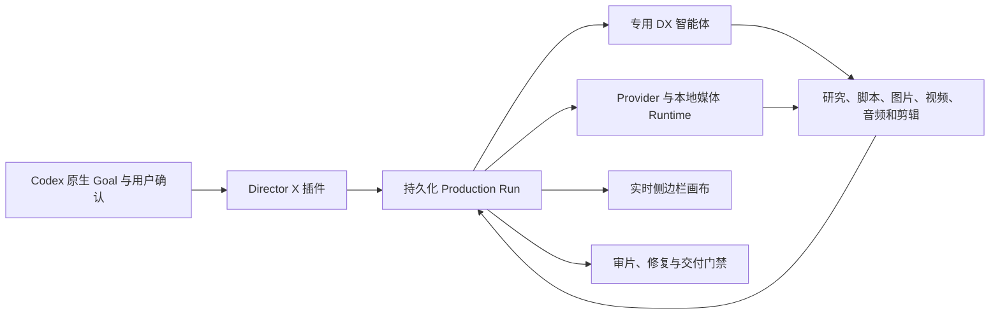

<p align="center">
  
</p>

<p align="center">
  <strong>为 Codex 打造的开源视频制片 Harness。</strong>
</p>

<p align="center">
  将一句创意需求转化为可持续运行、可审批、可恢复的视频制作任务，<br />
  使用原生 Goal、专用 DX 子智能体和实时侧边栏画布完成生产。
</p>

<p align="center">
  <a href="LICENSE"></a>
  
  
  
</p>

<p align="center">
  <a href="https://laplaceyoung.github.io/director-x/">产品网站</a> ·
  <a href="#快速开始">快速开始</a> ·
  <a href="#为什么使用-director-x">产品特色</a> ·
  <a href="README.md">English</a> ·
  <a href="skills/directorx/SKILL.md">生产 Skill</a>
</p>

---

Director X 是一层运行在 Codex 原生能力之上的 AI 视频制片编排系统。它不是新的图片、视频、语音或音乐模型，而是把不同模型、本地媒体工具和专业 Agent 组织到同一个持久化生产任务中。

当前开源版本是 **Director X Codex 插件**，也是未来完整 Video Harness 产品首先公开的组成部分。

> [!IMPORTANT]
> **接下来：**我们正在基于 [Pi Agent Harness](https://github.com/earendil-works/pi) Runtime 改造完整的 **Director X Video Harness**，并同步开发 **Electron 桌面端应用**，用于统一管理本地媒体、画布工作流、Provider、剪辑、审片和交付。


## 为什么使用 Director X

### Codex 原生 Goal

每支视频都绑定到真实的 Codex Goal。完成策划文档并不代表任务结束；只有目标媒体已经生成、通过审查并得到交付确认后，Goal 才能完成。

预算、模型路线、参考素材下载、重要剪辑修改和最终交付等决定，都通过 Codex 原生用户确认完成，不依赖容易混淆的普通聊天文字。


### 专用 DX 子智能体

Director X 注册了明确的视频制片角色，而不是把所有并行任务都交给匿名通用 Agent：

- `DX-Director`：创意方向和阶段决策
- `DX-Reference-Analyst`：参考片与来源分析
- `DX-Asset-Manager`：素材获取、来源、版权和质量检查
- `DX-Shot-Planner`：镜头、场景覆盖与连续性设计
- `DX-Model-Router`、`DX-Cost-Controller`：模型和预算路线
- `DX-Editor`、`DX-Quality-Reviewer`：剪辑、渲染和最终审片
- `DX-Approval-Producer`：整理需要用户确认的生产门禁

没有依赖关系的角色可以并行工作，同时保留清晰的任务归属、输入输出、依赖关系和交接记录。


### 实时侧边栏画布

侧边栏画布是持久化 Director X Run 的实时投影。研究资料、脚本、图片、视频、音频、剪辑版本和审片证据产生后，画布会同步更新。

画布围绕真实制片资产设计，而不是展示一张固定流程图：

- 预览生成或获取到的图片、视频和音频文件
- 绘制参考资料、脚本、关键帧、镜头和成片之间的关系
- 展示审批、阻塞、Provider 任务和恢复动作
- 查看时间线、字幕、波形、A/B 对比和逐帧审片证据
- 在浏览器页面或 MCP Runtime 重启后，从持久化状态继续

## 工作方式

```text
绑定 Codex 原生 Goal
        ↓
确认最少必要的创意与预算决定
        ↓
派发专用 DX 制片智能体
        ↓
研究、脚本、分镜、生成和剪辑
        ↓
在侧边栏画布展示媒体与关系
        ↓
审片、修复、渲染并确认交付
```

生产状态保存在 `.directorx/plugin-runs/`。画布只读取和投影这份状态，不维护第二套可能过期的事实源。

## 快速开始

### 环境要求

- 支持插件、原生 Goal、原生用户确认、子智能体和侧边 Browser 的 Codex 版本
- Node.js 22 或更高版本
- 用于本地媒体检查和渲染的 FFmpeg 与 FFprobe
- 只有在调用付费外部生成服务时才需要 Provider Key

### 安装插件

```bash
codex plugin marketplace add https://github.com/LaplaceYoung/director-x.git --ref main
codex plugin add directorx@openmoss-local
codex plugin list
```

安装后需要完整退出并重新打开 Codex。插件工具和自定义 `dx_*` Agent 角色在任务宿主启动时加载，已打开的旧任务无法可靠地热加载这些能力。

### 开始制作

在新的 Codex 任务中输入：

```text
@directorx 制作一支 30 秒产品宣传片。
使用原生 Goal，只询问会改变成片结果的问题，
在侧边栏画布展示获取和生成的媒体，
得到通过审查的成片之前不要结束任务。
```

如果插件没有打开侧边栏画布、没有创建 Goal，或者只生成了策划文档就结束，请确认插件已启用并完整重启 Codex 后，在新任务中重新调用。

## 主要能力

- 快速 Intake：先进入可见创作，详细治理工件延后补齐
- 官方来源优先的联网研究和带来源证明的本地素材
- 参考视频全帧分析、版权边界与原创迁移规则
- 脚本、镜头表、场景覆盖、转场和视觉提示词合同
- Provider 中立的图片、视频、语音和音乐路由
- 基于官方定价证据的项目、阶段、镜头和尝试预算
- 首尾帧连续性、多片段拼接和长视频交接
- Remotion、HyperFrames、FFmpeg、MOSS-TTS 和 Whisper 路线
- Director X Cut 证据驱动、审批后生效的时间线修改
- 完整解码帧审计和结构化最终质量审查
- 持久化检查点、最小恢复动作和单 Run 恢复机制

## 架构



插件包含三个主要部分：

- **Skills**：定义专业视频制作行为和工件合同。
- **MCP Runtime**：管理持久化 Run、审批、工具调用、Provider 执行、恢复和画布投影。
- **Browser Apps**：提供实时制作画布和 Director X Cut 剪辑界面。

Provider Key 只注入当前会话，不应写入 Git、持久化 Run JSON、日志或制片工件。

## 接下来正在开发

Codex 插件是首个开源版本，也是完整 Director X 产品线的公开验证入口。目前以下产品已经进入开发：

| 产品 | 状态 | 范围 |
| --- | --- | --- |
| Director X Codex 插件 | **现已开放 · 早期版本** | Codex 内的原生 Goal、DX 智能体、实时画布、制片工具、剪辑和审片 |
| Director X Video Harness | **正在开发** | 基于 [Pi Agent Harness](https://github.com/earendil-works/pi) Runtime 改造的视频原生 Harness，覆盖持久化生产执行、Provider 路由、媒体记忆、剪辑、审片和交付 |
| Director X Desktop | **正在开发** | Electron 桌面端应用，在一个制片工作区内统一管理本地项目、媒体、实时画布、Provider、剪辑、审片、渲染和交付 |

Video Harness 和 Electron 应用尚未包含在当前插件版本中。本仓库是 Director X 的开源 Codex 集成，也是验证视频制片合同和交互方式的公开开发入口。

## 本地开发

```bash
git clone https://github.com/LaplaceYoung/director-x.git
cd director-x
node --version
pnpm test
pnpm check
```

插件 Runtime 不包含生产 npm 依赖。测试覆盖 MCP 协议、持久化 Run、媒体画布、Provider 路由、剪辑、恢复和审片合同。

## 参与贡献

欢迎提交 Issue 和范围明确的 Pull Request。涉及生产工具行为的修改应包含回归测试，请勿提交 API Key、生成媒体或本地 `.directorx/` Run 数据。

提交前运行：

```bash
pnpm test
pnpm check
git diff --check
```

## 隐私与条款

- [隐私政策](PRIVACY.md)
- [服务条款](TERMS.md)
- [第三方声明](THIRD_PARTY_NOTICES.md)

## 许可证

Director X 使用 [GNU Affero General Public License v3.0 or later](LICENSE) 开源。

---

<p align="center">
  <strong>openmoss</strong> 出品，让视频制片过程可见、可控、可追踪。
</p>
