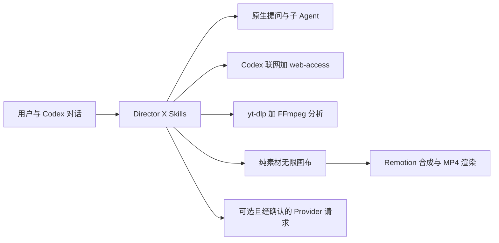

<p align="center">
  
</p>

# Director X — 开源 Codex AI 视频创作与理解插件

<p align="center">
  <strong>无限媒体画布 · 参考视频分析 · AI 生图/生视频提示词 · Remotion 渲染</strong>
</p>

<p align="center">
  <a href="LICENSE"></a>
  
  
  
  <a href="https://github.com/LaplaceYoung/director-x/actions/workflows/ci.yml"></a>
</p>

<p align="center">
  <a href="https://laplaceyoung.github.io/director-x/">官网</a> ·
  <a href="#当前能力">当前能力</a> ·
  <a href="#demo-成片">Demo 成片</a> ·
  <a href="#快速开始">快速开始</a> ·
  <a href="#当前架构">当前架构</a> ·
  <a href="#致谢与第三方工具">致谢</a> ·
  <a href="README.md">English</a> ·
  <a href="skills/directorx/SKILL.md">核心 Skill</a>
</p>

---

Director X 是一个开源、贴合 OpenAI Codex 原生设计的 AI 视频创作与理解插件。对话和决策仍在 Codex 中完成，插件在侧边栏打开无限画布，只呈现有用的制片内容：图片、视频、音频、脚本、剧本、分镜、镜头表、视觉系统、生图/生视频提示词和剪辑备注。

0.2.0 是从零重建后的基础版本。当前实现明确**不增加 MCP Runtime、不自建第二套 Agent 协议、不引入持久化工作流引擎，也不开发独立桌面应用**。Codex 仍然是宿主，负责原生提问、联网搜索和原生多 Agent 协作。

## 当前能力

- 打开无限侧边栏画布，预览项目内的图片、视频、音频和制作文本。
- 通过 Codex 原生 `request_user_input` 询问真正会改变结果的问题：一次只问一个决策，先调查可获得的事实，并把推荐答案放在首位。
- 使用 Codex 原生子 Agent 并行处理研究、参考片分析、视觉方向、素材和剪辑等边界明确的任务。
- 使用 Codex 联网能力，并以项目内置的 `web-access` Skill 补齐动态页面、登录态页面和媒体地址提取。
- 内置固定版本的 macOS `yt-dlp`，并使用项目依赖提供 FFmpeg/FFprobe。
- 对已获授权的参考视频下载、分离音频、抽帧、估算镜头切点、生成镜头板和采样色彩系统。
- 内置从 Flova 133 个 Skills 中提炼出的生图、生视频提示词写作能力。
- 当镜头需要生成模型但用户没有可用 API Key 时，在画布创建生成占位节点。节点保留完整提示词、排除条件、推荐模型、官方文档和目标规格。
- 使用 Remotion 构建简单媒体序列，渲染预览或最终 MP4。
- 本地保存 Provider 元数据，API Key 只从用户指定的环境变量读取。

插件不会把计划、分析、脚本或分镜当作最终交付。用户回答问题后，Codex 应在同一任务中继续推进，直到得到用户要求的可播放媒体。

## Demo 成片

下面两支 60 秒 WAIC × MOSS 宣传片是此前 Director X 产出的成片。点击封面可直接打开仓库内恢复的 MP4。

<table>
  <tr>
    <td width="50%">
      <a href="site/assets/demos/directorx-waic-moss-promo-v4.mp4">
        
      </a>
      <br />
      <strong>WAIC × MOSS 宣传片 · v4</strong><br />
      <a href="site/assets/demos/directorx-waic-moss-promo-v4.mp4">▶ 播放 60 秒成片</a>
    </td>
    <td width="50%">
      <a href="site/assets/demos/directorx-waic-moss-promo-v2.mp4">
        
      </a>
      <br />
      <strong>WAIC × MOSS 宣传片 · v2</strong><br />
      <a href="site/assets/demos/directorx-waic-moss-promo-v2.mp4">▶ 播放 60 秒成片</a>
    </td>
  </tr>
</table>

## 典型工作流

### 为歌曲制作 MV

Director X 可以引导 Codex：

1. 确认歌曲来源与素材使用权限；
2. 通过联网研究和 `yt-dlp` 获取已确认的来源；
3. 分离音频，并收集歌词、背景资料和歌手视觉参考；
4. 把音频、图片、研究、歌词、脚本和分镜放到画布；
5. 通过 Codex 原生提问确认创意方向；
6. 生成或获取镜头，用 Remotion 合成并渲染可播放视频。

### 分析并迁移参考宣传片

对于已获授权的本地文件或 URL，分析器会产出：

- 源视频元数据和分离出的 WAV 音频；
- 五分钟以内视频的完整抽帧，或更长视频的 2 fps 代理帧；
- FFmpeg 估算的场景切点和代表镜头帧；
- 联系表和分页镜头板；
- 镜头分析工作表；
- 色彩系统 JSON 和可视化色卡。

Codex 会继续检查镜头功能、构图、摄影机与主体运动、字体、灯光、色彩、转场、节奏和声画同步，再询问用户希望如何迁移这些创作原则。

## 无限画布

画布只包含面向用户的制片内容：

- `image`
- `video`
- `audio`
- `text`

文本节点支持安全的 Markdown 子集，包括标题、列表、表格、引用、代码、强调和链接。节点可以孤立，也可以声明素材依赖；依赖关系会校验为 DAG，并直接绘制在节点之间。工具栏提供 DAG 自动布局、适合画布、缩放按钮和快速定位，小地图支持点击或拖动导航。

画布不展示 Agent、审批、Provider 任务、内部日志或执行状态。连接线只描述制片素材之间的依赖，不代表内部 Agent 工作流。


> 上述及下方截图是恢复的早期 Director X 界面探索记录。当前 0.2.0 使用更简单的纯素材无限画布，不包含截图中的旧流程图、持久化 Run 或自定义 DX Agent 界面。

<table>
  <tr>
    <td width="70%">
      
    </td>
    <td width="30%">
      
    </td>
  </tr>
</table>

## 快速开始

### 环境要求

- 支持插件 Skill、原生用户提问、原生子 Agent 和侧边 Browser 的 Codex
- Node.js 22 或更高版本
- 当前内置 `yt-dlp` 可执行文件面向 macOS

### 本地开发安装

```bash
git clone https://github.com/LaplaceYoung/director-x.git
cd director-x
npm install
npm run ci
```

在 Codex 中将仓库根目录添加为本地插件，然后完整重启 Codex，让新任务加载插件 Skills。

### 初始化视频项目

```bash
node scripts/directorx.mjs doctor
node scripts/directorx.mjs init --project /path/to/video-project
node scripts/directorx.mjs canvas --project /path/to/video-project
```

在 Codex 侧边 Browser 中打开命令返回的本地地址。

### 分析参考片

```bash
node scripts/directorx.mjs analyze \
  --project /path/to/video-project \
  --input /path/to/reference.mp4 \
  --title "参考宣传片"
```

`--input` 也可以是用户已确认、且内置下载器支持的 URL。

### 向画布添加内容

```bash
node scripts/directorx.mjs add \
  --project /path/to/video-project \
  --type text \
  --title "分镜本" \
  --text "# 开场镜头"
```

媒体文件必须位于视频项目目录内，才能注册到画布。

可以在创建节点时声明依赖，也可以连接两个已有节点：

```bash
node scripts/directorx.mjs add \
  --project /path/to/video-project \
  --type text \
  --title "镜头 01" \
  --text "## 运镜\n\n缓慢推进。" \
  --depends-on BRIEF_NODE_ID

node scripts/directorx.mjs connect \
  --project /path/to/video-project \
  --from SHOT_NODE_ID \
  --to VIDEO_NODE_ID
```

### 没有 Key 时继续生成型制作

```bash
node scripts/directorx.mjs placeholder \
  --project /path/to/video-project \
  --modality video \
  --title "镜头 03 — 天台揭示" \
  --aspect-ratio 16:9 \
  --needs camera,identity,audio,multishot \
  --duration 6 \
  --resolution 1080p \
  --fps 24 \
  --prompt "从产品剪影开场，摄影机缓慢升起，城市天际线逐渐显现。"
```

生成的文本节点会明确标记为“等待生成权限”。折叠状态只展示预期输出；展开后显示详细提示词、排除条件、模型选择按钮、模型对应规格参数、核验状态和官方文档链接。推荐目录会考虑 Seedance/Seedream、Kling、Veo、Sora、GPT Image 和 Imagen。Happy Horse 在获得权威官方文档前只作为明确标注的未核验实验候选。Remotion 会忽略这些占位节点；Director X 不会把用户要求的生成镜头静默替换成动效合成。

### 合成与渲染

```bash
node scripts/directorx.mjs compose \
  --project /path/to/video-project \
  --title "我的影片" \
  --width 1920 \
  --height 1080 \
  --fps 30

node scripts/directorx.mjs render \
  --project /path/to/video-project \
  --quality preview
```

## 生图和生视频 Provider

Director X 不内置或硬编码任何生成服务 API Key。需要生成时，Codex 应询问 Provider、模型名称、官方文档，以及保存 Key 的本地环境变量名。

```bash
node scripts/directorx.mjs provider configure \
  --project /path/to/video-project \
  --id my-video-model \
  --provider Example \
  --modality video \
  --model example-video-v1 \
  --docs https://provider.example/docs \
  --endpoint https://api.provider.example/v1/videos \
  --auth-env EXAMPLE_API_KEY
```

Provider 请求必须显式传入 `--approved`，仅使用 HTTPS，只允许访问已配置的同源地址，并在保存请求记录时隐藏凭证。当前响应处理保持通用；不同模型的专用请求参数和结果适配器仍需后续实现。

## 当前架构



| 范围 | 当前实现 |
| --- | --- |
| 插件入口 | `.codex-plugin/plugin.json` 与 `skills/directorx/SKILL.md` |
| 画布 | `app/canvas.html`，数据来自 `.directorx/canvas.json` |
| 视频理解 | `scripts/analyze-video.mjs` 与 `scripts/lib/video-analysis.mjs` |
| 生成占位节点 | `scripts/lib/generation-placeholders.mjs` |
| 媒体 Runtime | npm 提供的 FFmpeg/FFprobe 与 `runtime/bin/darwin-universal/yt-dlp` |
| 提示词能力 | `skills/directorx-prompt-writer/` |
| 联网补齐 | `skills/directorx-web-access/` |
| Remotion | `remotion/` 与 `scripts/lib/remotion-project.mjs` |
| Provider 边界 | `scripts/lib/provider-profiles.mjs` 与 `scripts/lib/provider-request.mjs` |

项目状态保存在项目自己的 `.directorx/` 目录，包括画布、分析工件、Provider 配置、生成的 Remotion 文件、Provider 请求记录和渲染结果。

## 致谢与第三方工具

Director X 的实现离不开以下优秀的第三方项目，感谢所有维护者和贡献者。

| 项目 | 用途 | 许可证或说明 |
| --- | --- | --- |
| [yt-dlp](https://github.com/yt-dlp/yt-dlp) | 获取用户确认过的在线视频与音频来源 | The Unlicense；Director X 内置固定版本的 macOS 可执行文件及许可证文本 |
| [FFmpeg](https://ffmpeg.org/) 与 [ffmpeg-static](https://github.com/eugeneware/ffmpeg-static) | 音频分离、抽帧、镜头证据、转码和媒体检查 | 通过 `ffmpeg-static` 与 `@derhuerst/ffprobe-static` 提供，包声明为 `GPL-3.0-or-later` |
| eze-is 的 [web-access](https://github.com/eze-is/web-access) | 困难网页的浏览器研究和媒体地址提取 | MIT；适配的上游版本与提交记录在 `skills/directorx-web-access/UPSTREAM.md` |
| [React](https://github.com/facebook/react) | Remotion 合成和渲染组件 | MIT |
| [Remotion](https://github.com/remotion-dev/remotion) | 程序化视频合成、预览和 MP4 渲染 | 使用 Remotion 自有许可证；部分组织需要购买 Company License |

Codex 原生提问方式还参考了 Matt Pocock 的 [Grilling Skill](https://github.com/mattpocock/skills/blob/main/skills/productivity/grilling/SKILL.md)。

每个第三方项目仍由其自身许可证和使用条款约束。准确说明请查看 [runtime/THIRD_PARTY.md](runtime/THIRD_PARTY.md)、内置许可证文件、npm 包许可证以及上游声明。

## 本地开发

```bash
npm run validate:plugin
npm run check
npm test
npm run ci
git diff --check
```

请勿提交凭证或视频项目生成的 `.directorx/` 数据。内置及 npm 提供的媒体工具保留各自的第三方许可证，详见 [runtime/THIRD_PARTY.md](runtime/THIRD_PARTY.md)。

## 许可证

Director X 使用 [Apache License 2.0](LICENSE) 开源。
